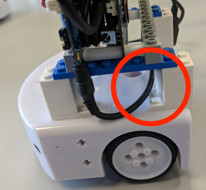

# Mighty Thymio instructions for the Robotics USI Course 2019

## Transportation

We provide the Mighty Thymio with a small bag.

What is included?


1. Thymio
2. Main computer block composed of:
   1. Main computer
   2. Connection wires
   3. Lego frame
3. Battery pack
4. WiFi antenna


### Packing

To pack the robot safely in the bag, first

1. remove the micro-USB cable,

2. remove the power-pack,

3. remove the WiFi dongle,

4. unplug the power cable from the Odroid (top of the robot),

to avoid breaking fragile parts. You may want to put the dongle and the cable in the now empty power-pack slot.

Insert the robot in the bag and then the battery back behind it. Close firmly.

### Unpacking and assembling

Remove the robot by holding it from the top. Then

1. attach the WiFi dongle;

  

2. attach the micro USB cable;

  

3. connect the power pack:

    i. run the power cable from the Odroid battery plug (bottom) through the spacers on the side of the power-pack slot,

    

    ii. insert the power-pack,

    iii. pull gently the power cable on the USB side so that it is not loose,

    iv. attach the power cable to the power-pack,

    v. fit the remaining of the cable between the Odroid and the LiPo battery,

    vi. attach the power cable to the Odroid (top).

The assembled Mighty Thymio should look like as depicted:


## Powering on

Make sure the external battery pack is properly charged, otherwise the system will be unstable.  

1. Activate the power-pack by pressing the button on the side (blue LEDs will switch on to mark its charge); if the system is properly assembled, a blue LED on top of the battery switch should turn on;

2. move up the switch on the LiPo battery board to start powering the Odroid

3. wait about 1 minute until the robot start blinking.

## Powering off

1. Long press on the Thymio's inner-most arrow button (about 8 seconds);

2. wait until the Odroid and the Thymio shut down (the robot will turn its LED off);

3. move down the switch on the LiPo battery board to power off the Odroid;

4. the Thymio (just the robot, not the Odroid) will switch on again by itself: long press on the central button to switch it off definitely.

## Connecting

The Mighty Thymio number `N` create its own WiFi network called `Thymio<N>`. Connect to it.

It is also possible to connect the robot to the `drone_wifi` router (if available):

  1. long press on the left arrow (as seen from the robot's; perspective)

  2. after 5 seconds a yellow mark will appear; move it with the right arrow for:

     - top: switch WiFi off
     - top right: switch on the access point (default mode)
     - right: connect to `drone_wifi`

In both networks, `Thymio<N>` will be reachable at address `thymio<N>`. For example, to ping

  ```bash
  ping root@thymio<N>
  ```

### Hosts file
If you cannot connect or ping add the address to the [`/etc/hosts`](https://en.wikipedia.org/wiki/Hosts_(file)) list:
```
<IP>  thymio<N>
```
where `<IP>` is
  - `192.168.168.1` on its own access point,
  - `192.168.201.<N>` on `drone_wifi`.

### VM Bridged mode

If you use a virtual machine, set up networking as bridged mode.

### Ethernet bridge

Do you need internet while connected to the Mighty Thymio's access point? Then connect an ethernet cable to the Odroid.


## Using with ROS

### Installation

Install the following ROS packages in your catkin workspace

```bash
cd <your catkin workspace>/src
git clone https://github.com/jeguzzi/thymioid.git --branch client
git clone https://github.com/jeguzzi/ros-aseba.git --branch client
catkin build
```

### Setting up the environment

```bash
export ROS_MASTER_URI=http://thymio<N>:11311
# Only in case networking is not working with names
export ROS_IP=<your IP>
```

### Additional information

- [Interface with the robot](https://github.com/jeguzzi/mighty-thymio/blob/master/client.md)
- [Calibrate the robot motors](https://github.com/jeguzzi/mighty-thymio/blob/master/calibration.md)
